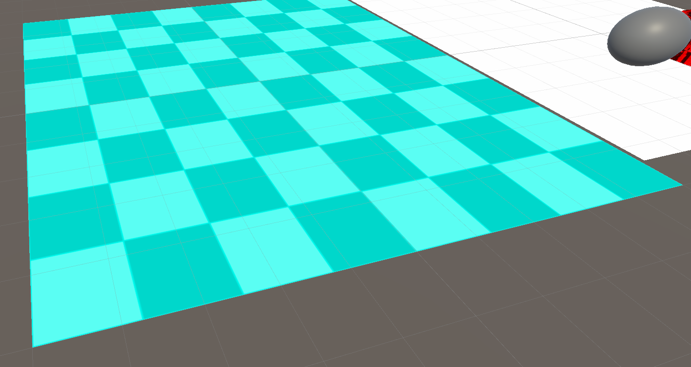

# Hack Technology / Project Attempted

## What you built? 

* For my hack-a-thing, I tried to build __custom shaders__ in Unity through code and shader graphs! 
* Shaders are used to calculate the color of every rendered pixel based on lighting and Materials.
* Spent a lot of time looking at documentation for both the CG/HLSL shader language.

__Screenshots!__

## Who Did What?

I worked on this project alone and did all the work with writing shaders, creating shader graphs, and implementing them onto basic Unity GameObjects.

## What you learned

__What worked:__
1. Creating a custom unlit shader that can be modified
2. Took a lot of trial and error to implement the new HLSL shader from old CG shader
2. Creating custom shader graphs
3. Using different shader graph nodes to blend, multiply, color, etc. 

__What didn't work:__
1. Water Shader (I think the original mesh filter I used is not fragmented enough, so the depth wasn't working)
2. The old deprecated unlit shader code (CG)  --> had to use HLSL (new way to write shaders)

## Authors

Julian Wu '22

## Acknowledgments

1. Intro to Shaders
    * https://www.youtube.com/watch?v=C0uJ4sZelio&ab_channel=quill18creates
    * https://www.youtube.com/watch?v=vKveOrl5Q7U&ab_channel=quill18creates

2. Water Shader
    * https://www.youtube.com/watch?v=gRq-IdShxpU&ab_channel=Unity

3. Intro to Shader Graphs
    * https://learn.unity.com/tutorial/introduction-to-shader-graph#5f500900edbc2a0022843fb6
    * https://www.raywenderlich.com/3744978-shader-graph-in-unity-for-beginners

